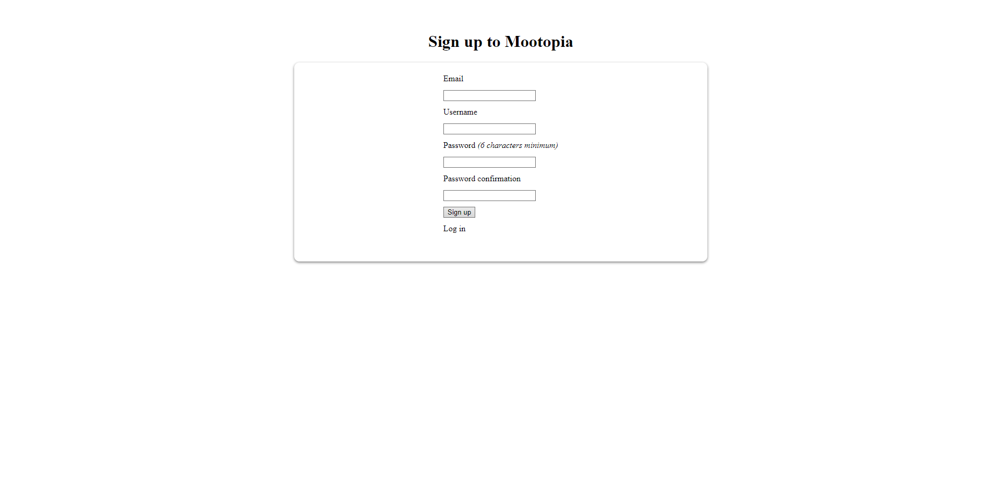
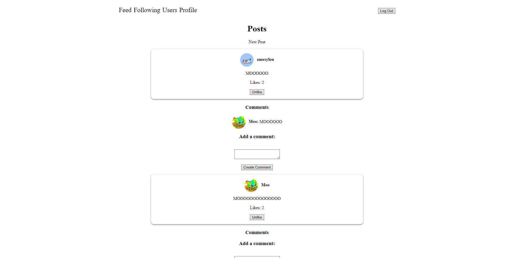
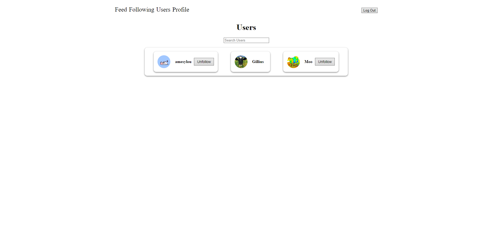
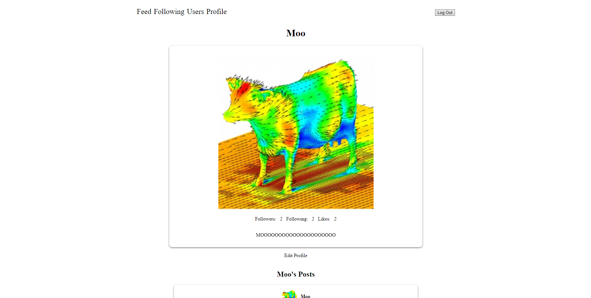

# Mootopia

This is for the final project of [The Odin Project](https://www.theodinproject.com/lessons/ruby-on-rails-rails-final-project).

Live Demo:
    https://mootopia-qjj2.onrender.com

## Features

- Accounts
    - Authenication with the Devise Gem
    - Log in / out

- Posts
    - Can be viewed on the Feed, Following and User Profile pages
    - Users can create, update and delete Posts

- Likes
    - Other users can Like/Unlike Posts
    - Number of Likes are displayed on the post

- Comments
    - Comments can be made on Posts
    - can be edited or deleted

- Users/Following
    - Users can see and search for all users on the platform
    - Users can Follow/Unfollow other users
    - Following page only displays posts from people you are following

- Profile
    - Profile are created by default after signing up
    - Displays Profile picture, bio and total likes, followers and followings
    - Users can edit their Profile
    - Show all of the users Posts

## Screenshots

